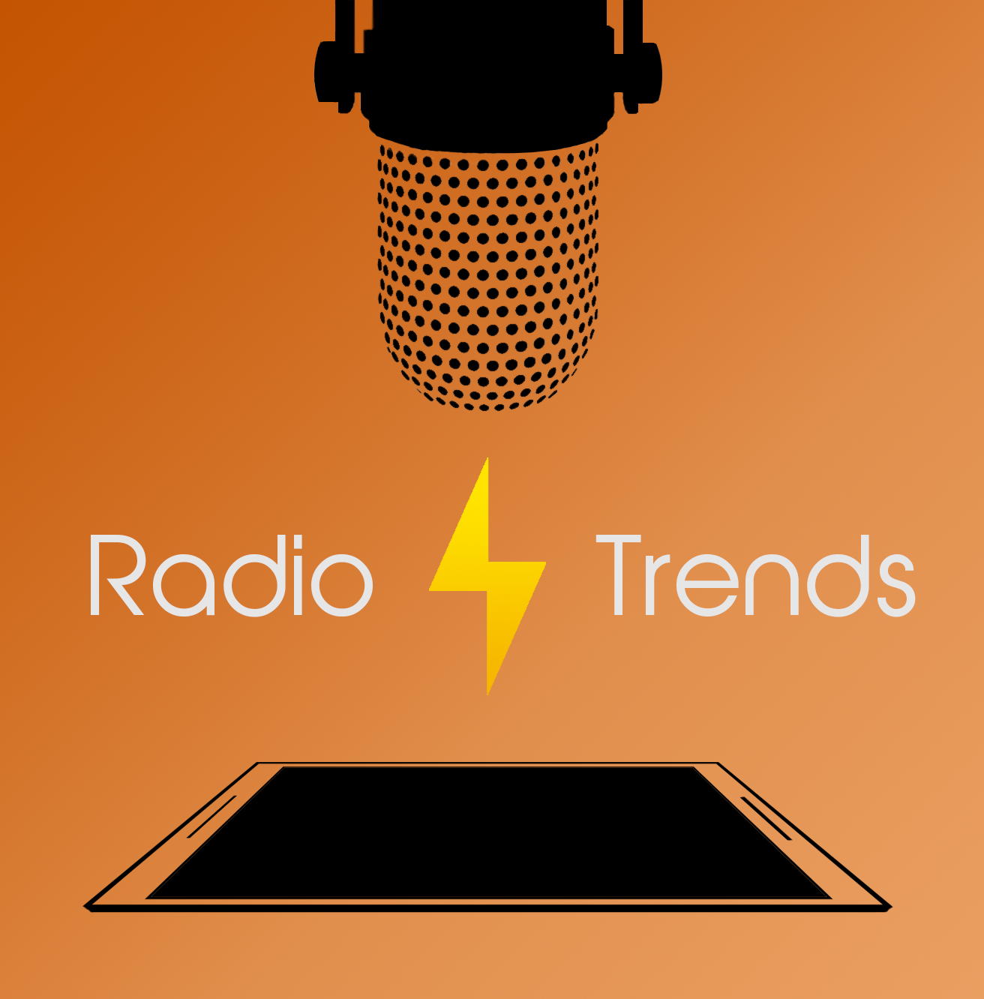

RadioTrends es una tecnología vanguardista que ofrece estadísticas de audiencia en vivo a radioemisoras a lo largo de todo Chile y el mundo.

### ¿Para qué sirve?
Nuestros clientes contarán con múltiples indicadores de consumo que destacan por su fidelidad y disponibilidad _on demand_. Esto permitirá la toma de decisiones ejecutivas con una precisión sin precedentes en la industria radial, pues nunca antes ha sido más fácil y valioso comprender cómo ciertos programas, comerciales o anuncios son percibidos por la audiencia.

### ¿Cómo funciona?

A través de nuestra plataforma web, las radioemisoras podrán disfrutar del servicio al obtener en sus _dashboards_ no sólo el consumo instantáneo e histórico que nuestro sistema reporte, sino que además apreciarán variadas estadísticas respecto a los horarios de escucha o programas más populares, el desempeño de su competencia, y la detección de fuga de auditores, entre otras. 

Los auditores de nuestra plataforma colaboran a través de sus _smartphones_ de manera totalmente anónima y privada, ofreciendo sus patrones de radioescucha a cambio de atractivos beneficios. Por otro lado, aseguramos la fidelidad de la información recopilada mediante avanzadas técnicas de inteligencia artificial.

#### Un ejemplo de medición de registros en tiempo real:

<iframe width="560" height="315" src="https://www.youtube.com/embed/f4TxrZv_kKs" frameborder="0" allow="accelerometer; autoplay; encrypted-media; gyroscope; picture-in-picture" allowfullscreen></iframe>

[<ins>Detalle por programas</ins>](https://raw.githubusercontent.com/RadioTrends/RadioTrends.github.io/master/s1.png)

[<ins>Detalle por productos</ins>](https://raw.githubusercontent.com/RadioTrends/RadioTrends.github.io/master/s2.png)

### Novedades

Esta es una lista de novedades que hemos querido publicar para mantener una bitacora de avances, eligiendo algunos de los hitos más relevantes:

#### Ya contamos con una advisory board
Conformamos una advisory board gracias a la amable participación de Roberto Muñoz, Senior Data Scientist en EY Boston, Hans Lobel, Profesor Adjunto del IA Lab en la PUC, y Pablo González, Gerente General de Europastry Chile, quienes nos prestarán su consejo y retroalimentación en materias específicas al desarrollo y comercialización de RadioTrends. Abr-2020

#### 13Radios lo considera vanguardista y un adelanto para la industria
Proyecto vanguardista Sostuvimos una interesante y gratificadora reunión con Mauricio Gallardo, Director Comercial de 13Radios, importante conglomerado nacional de radios en el mercado de la radiodifusión de Chile, quien nos alentó a continuar por considerar que este proyecto está efectivamente a la vanguardia de la tecnología y proporcionará un adelanto muy importante para esta industria. Abr-2020

#### Equipo fundador de RadioTrends
Incorporamos al tercer y último co-fundador del emprendimiento, enterando así un grupo aclanado, los tres parientes de la familia ‘Cerda’, cada uno aportando con su perfil que resulta complementario y potencia al equipo: Patricio con larga trayectoria como ejecutivo en empresas Telco y con vasto conocimiento tecnológico, Patricio Junior con su avanzado conocimiento computacional y de inteligencia artificial a punto de graduarse de Magíster en Ciencias de la Computación de la PUC y de la especialización en la que participó en Suecia y Dinamarca, y Ricardo con su experiencia en emprendimientos adquirido a través de su constante búsqueda de oportunidades que lo llevó a intentarlo ya dos veces anteriormente, además a asistir a cursos de especialización en Hong-Kong y Portugal, y con el conocimiento que está obteniendo de sus estudios profesionales cursando el quinto año de Ingeniería Civil en la UAI. Mar-2020

#### Funciona maravillosamente
Completamos una maqueta funcional del producto, integrado por cinco componentes de software y procesos que conforman un sistema capaz de captar, filtrar, procesar, reconocer audios y generar estadísticas para compartirlas a los clientes suscritos. Ene-2020

#### Búsqueda de fondos para acelerar el proyecto
Decidimos postular a un programa de aceleración de emprendimientos para obtener fondos que nos permitan consolidar el proyecto y comenzar la comercialización, y lo haremos a través de Startup Chile Seed en Abril 2020. Feb-2020

#### Proyecto de alto potencial según destacado analista internacional
Interesante reunión con Libardo Buitrago, en donde se analiza el alcance de nuestra plataforma y el estado actual de estimación de audiencia en la industria radial chilena, concluyendo que representa un proyecto con alto potencial y que debiera ser de interés para varios altos ejecutivos del sector. Mar-2019

#### Bautizamos el proyecto
RadioTrends es el nombre con que hemos bautizado nuestro emprendimiento, aludiendo a mercado de la radiodifusión y a las tendencias de audiencia. Oct-2019

#### ¡Esta idea es muy buena: vamos a desarrollarla!
Iniciamos un emprendimiento para implementar y comercializar nuestro proyecto de elaboración de estadísticas de audiencia de radiodifusión en tiempo real, consolidando la idea original de un socio y los avanzados conocimientos computacionales y de IA del otro socio fundador. Sep-2019

### ¿Quiénes somos?

RadioTrends es un equipo de tres cofundadores, ejecutando la idea a partir de la que nace el proyecto con novedosas técnicas computacionales. Este proyecto de alto impacto está en etapa semilla, buscando financiamento activamente.

### ¡Contáctanos!

Nos encantaría conversar contigo para ver cómo RadioTrends puede usarse para tus necesidades, escríbenos a [<ins>radiotrends@cerdini.cl</ins>](mailto:radiotrends@cerdini.cl).
